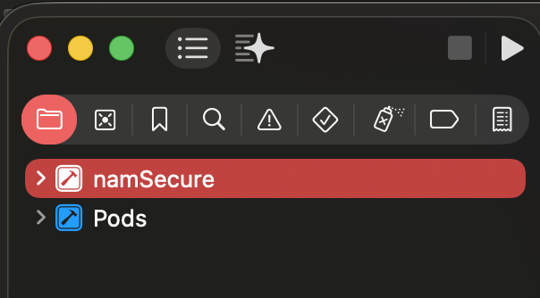
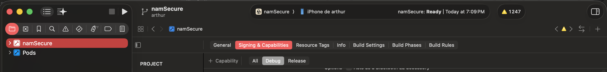
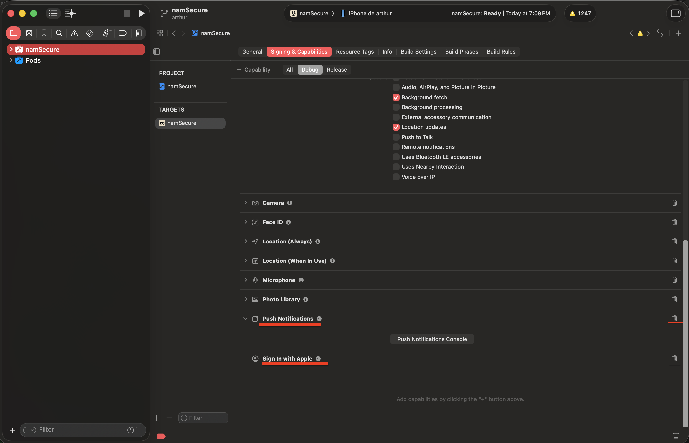

# NamSecure


## Prérequis

- iOS 26+ (iOS 26.2 recommandé)
- .env (se trouve sur moodle dans le .zip de la partie "mobile")

## Backend & Cloud

Le backend se trouve sur moodle dans le .zip de la partie "mobile". 

```bash
cd /backend
docker-compose up
```

## Mobile

```bash
cd /shared
npm i
npx tsc
npm link
```

```bash
cd /client/mobile/namSecure
npm i
npm link '@namsecure/shared'

npx expo run:ios
```

### Notes
Le réinitialisation du mot de passe via le lien dans l'email ne fonctionnera que si le backoffice est en cours d'exécution.


### Troubleshooting
Si vous rencontrez des problèmes lors de la compilation, essayez les étapes suivantes :

1. Ouvrir le dossier ios dans Xcode
2. Cliquer sur namSecure


3. Aller dans "Signing & Capabilities"


4. Changer le Bundle Identifier (ex: com.NAME.namSecure.app)
5. Supprimer "Push Notifications" et "Sign in with Apple"
